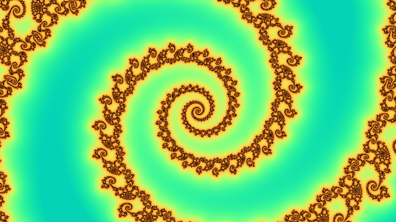
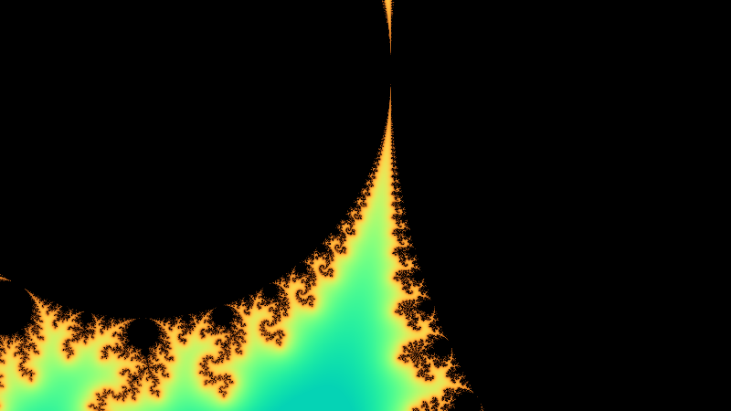
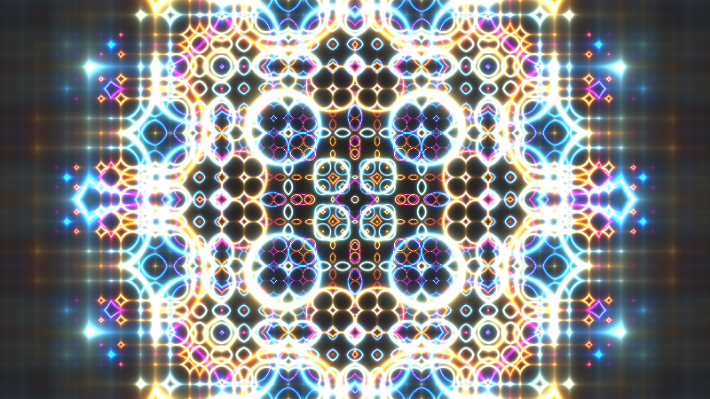
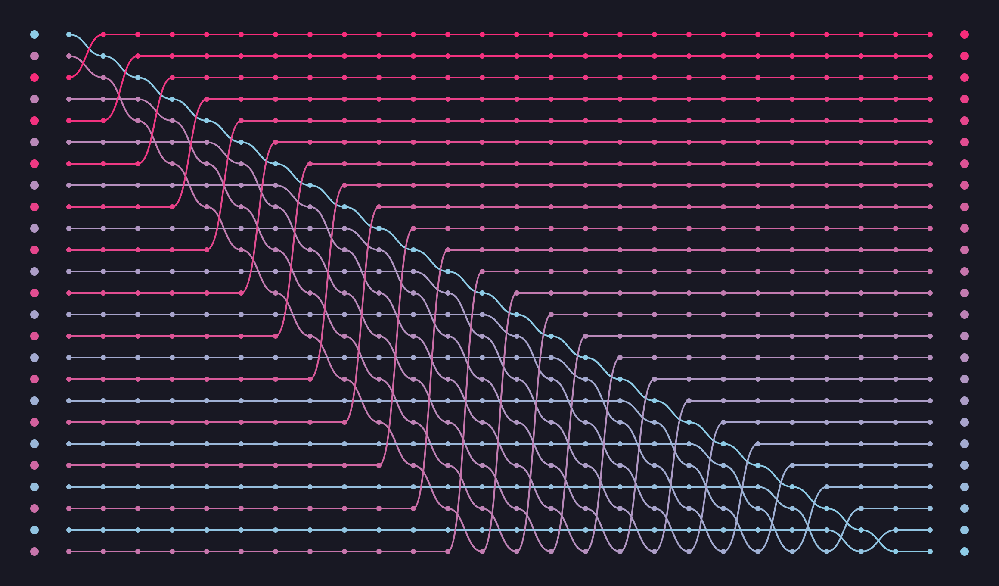
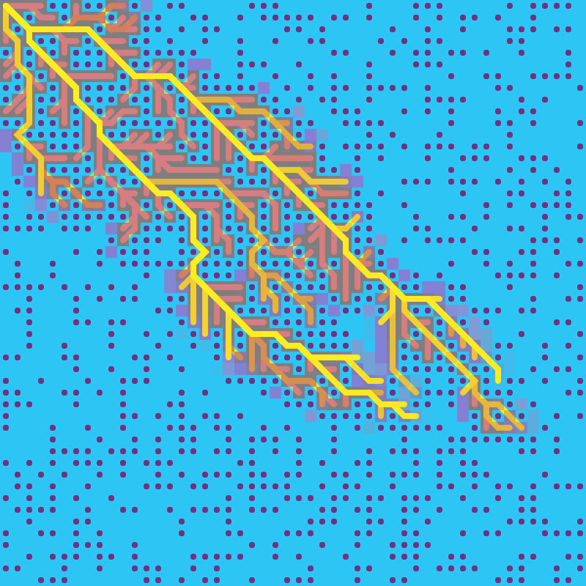
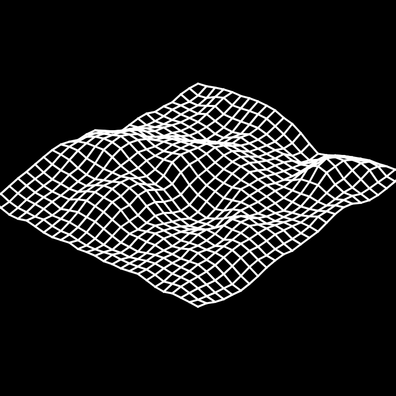
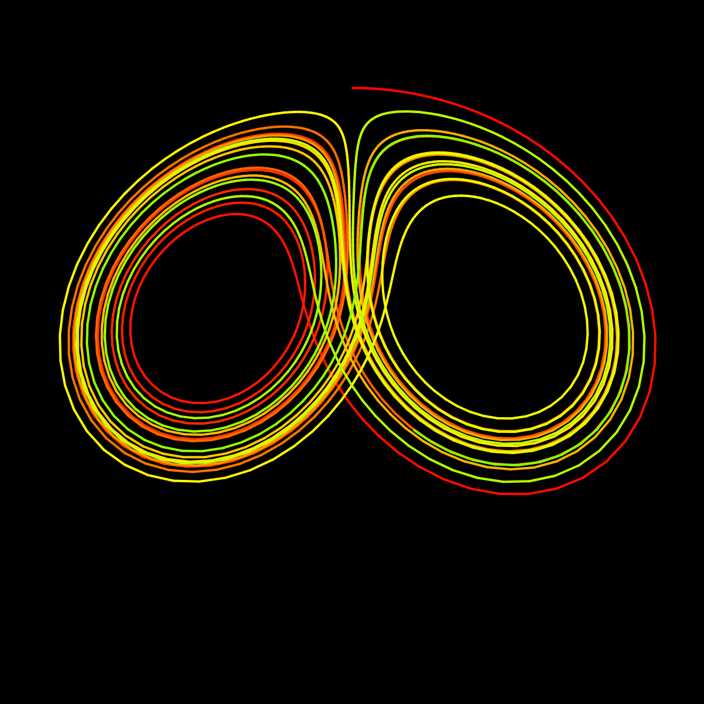

# This is a collection of few of the creative coding sketches I did using the P5.js library and ShaderToy GLSL Coding Environment

# GLSL sketches

[MANDELBROT FRACTAL ZOOM : VIEW SHADERTOY CODE](https://www.shadertoy.com/view/mlsfRB)

[NEON MIRROR FRACTAL : VIEW SHADERTOY CODE](https://www.shadertoy.com/view/mlScWd)

# P5.JS SKETCHES

[Itrative Visulaization of Bubble Sort : VIEW p5.js CODE](https://editor.p5js.org/adityameena1one/full/0CtduRzQW)

[Pathfinding using the A\* Algorithm : VIEW p5.js CODE](https://editor.p5js.org/adityameena1one/sketches/E3w_uoR5E)

[ISOMETRIC PROJECTION FROM 3D-2D : VIEW p5.js CODE](https://editor.p5js.org/adityameena1one/sketches/9FE-WFf3F)

# SIMULATING CHAOTIC SYSTEMS IN P5.JS

[DOUBLE PENDULAM : VIEW p5.js CODE](https://editor.p5js.org/adityameena1one/sketches/4bVRb8EOU)

[LORANTZ ATTRACTOR : VIEW p5.js CODE](https://editor.p5js.org/adityameena1one/sketches/1SdiNiKzl)

